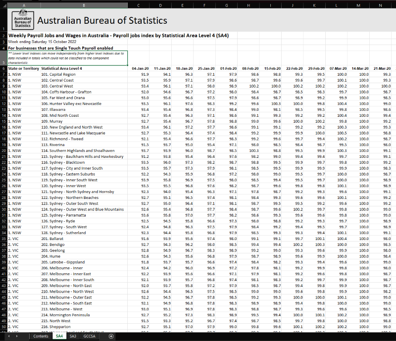

Mapping with R
================

## Overview

This repository contains presentation materials for *Mapping with R:
Static, Dynamic, and Mapped* as presented live in Melbourne for the Data
Vizualisation Society and on YouTube. The files are:

- `README.Rmd`: This file.  
- `README.md`: Knit output for easy display on GitHub.  
- `dataVizMaps.qmd`: Quarto file, including code chunks, image links,
  and plain text.  
- `jobsOct2022.xlsx`: Excel data file from the Australian Bureau of
  Statistics (ABS).  
- Presentation Images:
  - `jobsDataSS.png`: Screenshot of the Excel file for an overview of
    the input data.  
  - `asgsGeography.png`: Screenshot of the geography standards used by
    the ABS.  
  - `mapMeme.jpg`: Meme of putting maps in your map.  
  - `mapnmap.jpg`: Image export of the *maps-in-a-map* concept.  
  - `leafletReference.jpg`: Screenshot of news article that uses Leaflet
    as part of their data journalism. My aim is to provide examples
    where Leaflet is used in the “real-world” and give you confidence
    that you can make similar visualisations yourself.  
  - There were other pictures of me at various points in my professional
    journey, but I’ve removed them.
- Branding:
  - `logo.css`: Scaled my consulting company logo. I was also playing
    with some of the code window settings but went back to the default.
    Use it to try to customise things if you’d like.  
  - `img/Doc_SS_Black-01.png`: My company logo.

### Exceptions

The following exceptions are noted:

1.  **Map Tooltips**: The *maps-in-a-map* works interactively, but
    something in the file organisation structure in Quarto doesn’t align
    with the file outputs.

If you run the code interactively (rather than through rendering the
document), it should work for you.

To do this:

- Launch `RStudio` with the `dataVizMaps.qmd` file.  
- Ensure all the libraries are installed, including
  `wfmackey/absmapsdata` from Github.  
- Check that you have the Excel data file.
- Find the `mapFunction` code chunk .  
- Execute the previous chunks with the down arrow on the upper-right of
  the code chunk.  
- Execute the `mapFunction` chunk. This should generate the
  `sa4MappedMap` variable.  
- Interactively view `sa4MappedMap`. This should display the
  *maps-in-a-map* in the `RStudio` viewer pane.

2.  **Data**: The example data provided are in Excel and seem to be
    manually extracted and stored. If you get future data, the sheet
    name, skip parameter, and variable order may shift. Further, the
    `absmapsdata` package is available from GitHub but is quite large.
    You might need to adapt the `timeout` parameter to get it to
    install, depending on the speed of your connection.

As `absmapsdata` is a user-maintained package (go give some love to
`wfmackey` while you’re there), note that future updates may change
variable names and/or formats.

3.  **Images**: I’ve included some of the images I used in the
    presentation but I’ve omitted photos of me that I included in the
    live presentation.

## Data

Data have been sourced from the [Australian Bureau of
Statistics](https://www.abs.gov.au/statistics/labour/jobs/weekly-payroll-jobs-and-wages-australia/latest-release),
with the latest data being from October, 2022. The data are in Excel
with a small amount of *tidying* required for the data.

Similar means are used to *tidy* the data for SA4 and SA3 geographies
using the `tidyverse`, including:  
\* Use of `tidyr::separate`[^1] to break the SA4 column into its code
and name parts.  
\* Use of `tidyr::pivot_longer` to get the dates into a column rather
than wage index by date. \* Various `dplyr` calls to format values
(e.g., align Excel dates, etc).

Further, geographic information are from the `absmapspackage`, as
available on GitHub as
[`wfmackey/absmapsdata`](https://github.com/wfmackey/absmapsdata). Note
the package is large, so you might need to adjust the timeout options.
There are other examples of making maps on that page.

## Maps

The code contains three types of maps, as hinted in the subtitle.

1.  **Static**: Made with `ggplot` - a good starting point, and useful
    if your reports are PPT, PDF, etc.  
2.  **Dynamic**: Made with `leaflet`. As the plots are HTML/JS based,
    you’ll need a browser or the `RStudio` viewer for these plots.  
3.  **Mapped**: Considerations on using the `purrr::map` function to
    generate many maps - whether static or dynamic.

### Static: Maps with `ggplot`

A basic introduction to maps with `ggplot`, as it’s likely the first
graphing tool you’ll use when learning `R`. For advanced usage, I
recommend the `ggmap` package and the examples therein. Note that Google
has changed some of their usage terms to require authentication and a
credit card, but not all of the providers require this.

### Dynamic: Maps with `leaflet`

While I use `leaflet` to make some maps with custom tooltip (or `label`)
information, there are many other configuration options. The [leaflet
for R](https://rstudio.github.io/leaflet/) page has some great examples.

Other dynamic map tools for `R` exist; I’ve used `highcharter` before
and it works well.

### Mapped: Using `purrr::map`

I’ve mainly included this as a play on words, as “You can use `map` to
put maps in your map” has a certain ring to it. There’s a bit of a
caveat here, in that you can use `map` to create maps quite efficiently,
but the usability of hundreds of maps is limited by human capacity to
retain information.

[^1]: Oh, it seems `separate` is deprecated. Huh.
